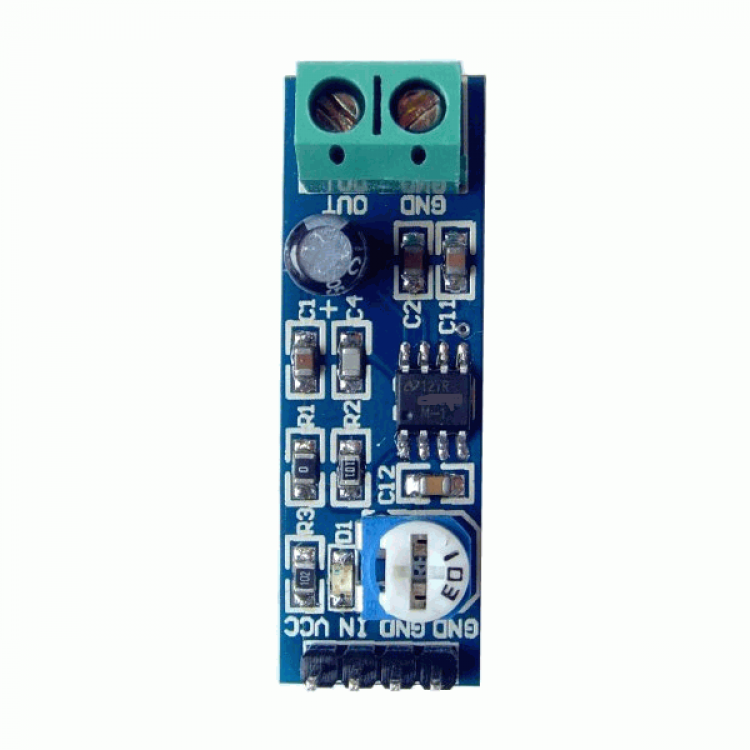
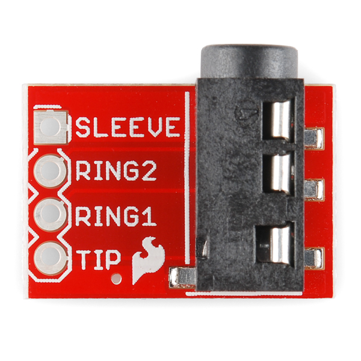
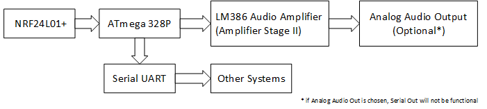
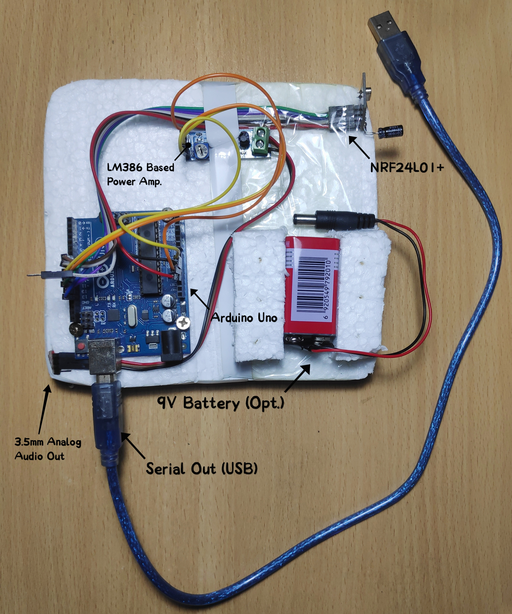

# VoiceRemoteRx

## Hardware Configuration

### Interfacing nRF24L01 with MCU

Pinout of nRF24L01 is following:


The power consumption of this module is just around 12mA during transmission, which is even lower than a single LED. The operating voltage of the module is from 1.9 to 3.6V, but the other pins tolerate 5V logic. SCK, MOSI and MISO - these pins are for the SPI communication and they need to be connected to the SPI pins of the Arduino, but note that each Arduino board have different SPI pins. The pins CSN and CE can be connected to any digital pin of the Arduino board and they are used for setting the module in standby or active mode, as well as for switching between transmit or command mode. The last pin is an interrupt pin which doesn’t have to be used.

For the Tx module of this project, pins of nRF24L01 module will be connected to Arduino according to the following table:

| nRF24L01 | Arduino Nano/Uno | Arduino Mega |
|--|--|--|
| V<sub>cc</sub> (3.3V) | 3.3V | 3.3V |
| GND | GND | GND |
| CSN<sup>[1](#footnote1)</sup> | 8 | 8 |
| CE<sup>[1](#footnote1)</sup> | 7 | 7 |
| SCK | 13 | 52 |
| MOSI | 11 | 51 |
| MISO | 12 | 50 |
| IRQ | Not Connected | Not Connected |

#### LM386 Audio Power Amplifier and TRRS Breakout

> This step will only be necessary only if *analog audio output* is required. **Note that, Serial output will not be functional and hence button signal reception will not be possible in this case.** For only serial output skip this step.



LM386 Audio Amplifier Module has 4 input pins and an output wiring block with GND and OUT.

Input pins connections are shown below.

| Stage II input Pin | Arduino Pin |
|--|--|
|Vcc|5V|
|IN|9|
|GND (audio) |10|
|GND|GND|

A TRRS Breakout board could be connected to the Amplifier out so that standard audio output devices (eg. *speakers, headphones*) could easily be connected.



It has to be be connected in following fashion: 

| Amplifier Output Pin | TRRS Pin |
|--|--|
| Output | TIP |
| Output | RING1 |
| GND | RING2 |
| X | SLEEVE |

High level block diagram of the receiver system may further clarify the construction.



### Sample Hardware

A labeled Figure of the hardware implementation.



## Loading Sketch

Install and configure the following tools:

1. Visual Studio Code
2. Platform IO Extension

For detailed instruction of this step please go to [this documentation](https://github.com/nsssayom/VoiceRemoteTx#loading-sketch).

### Serial Reception Mode

This is the default mode of this receiver module. The data packets received from the transmitter module will be directly written to the Serial Port with baud rate **115200**. Packet size is 32 byte. The data format and protocol is described [here](https://github.com/nsssayom/VoiceRemoteTx#data-format).  

### Analog Audio Mode

This mode can be accessed by uncommenting `line 14` of `src/main.cpp`. 

```cpp
#define AnalogAudioMode 
```

***In this mode, serial output and button signal reception will not be possible.*** Analog audio signal will be available at `pin 9 and 10` of the Arduino Board. If the optional hardwares described in [this step](#LM386-Audio-Power-Amplifier-and-TRRS-Breakout) are present then any standard computer speaker or headphone can be used to listen to the audio being transmitted from the transmitter upon holding the <kbd>*</kbd> button there.

### Upload Sketch

Upon connecting the board and configuring it correctly, Open VS Code command pallette with pressing <kbd>Ctrl</kbd> + <kbd>Shift</kbd> + <kbd>P</kbd>.

Use the `PlatformIO: Upload` command to upload the code to the board.

## References

1. How nRF24L01+ Wireless Module Works & Interface with Arduino, [Last Minute Engineering](https://lastminuteengineers.com/nrf24l01-arduino-wireless-communication/)
1. Texas Instruments, LMx58-N Low-Power, Dual-Operational Amplifiers [Datasheet](https://www.ti.com/lit/ds/symlink/lm358-n.pdf?ts=1594025525189&ref_url=https%253A%252F%252Fwww.google.com%252F)
1. Texas Instruments, LM386 Low Voltage Audio Power Amplifier
[Datasheet](https://www.ti.com/lit/ds/symlink/lm386.pdf)
1. TMRh20 2020, RF24 - Optimized high speed nRF24L01+ driver [Documentation](http://tmrh20.github.io/RF24/)
1. TMRh20 2020, RF24Audio - Realtime Audio Streaming Library for Arduino [Documentation](http://tmrh20.github.io/RF24Audio/)
___

##### Footnotes

<a name="footnote1">[1]</a> Declared in code</br>
<a name="footnote2">[2]</a> Originally D10 was used. Later changed to match the transmitter module.</br>
[3] ␂ is ASCII Character (02)<sub>10</sub></br>
[4] ␄ is ASCII Character (04)<sub>10</sub>
